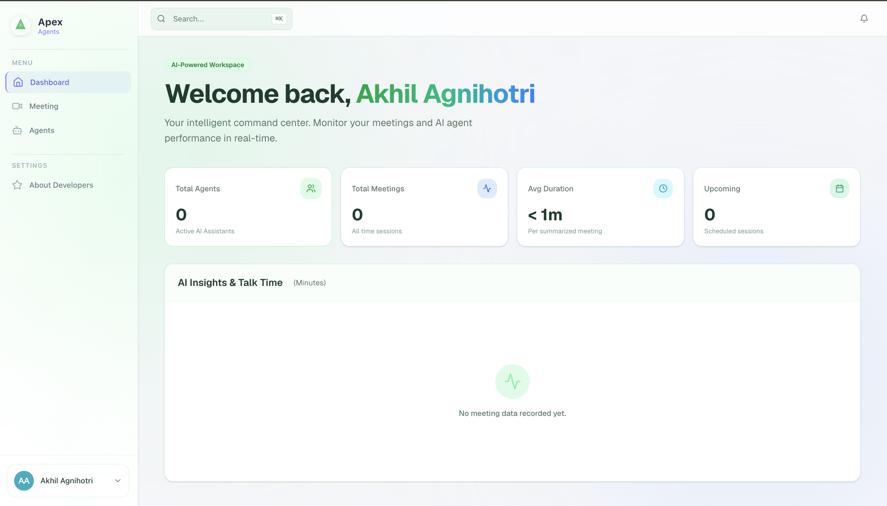
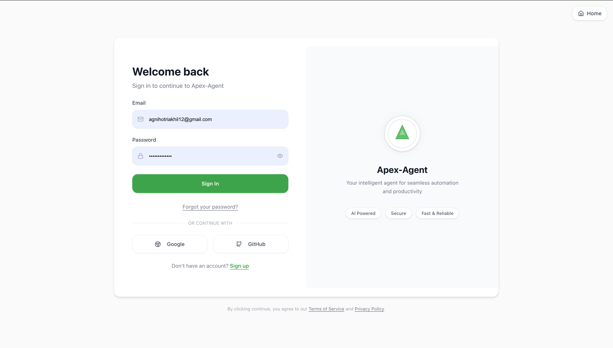
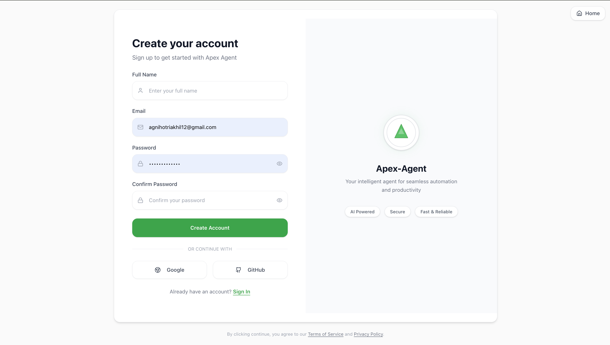
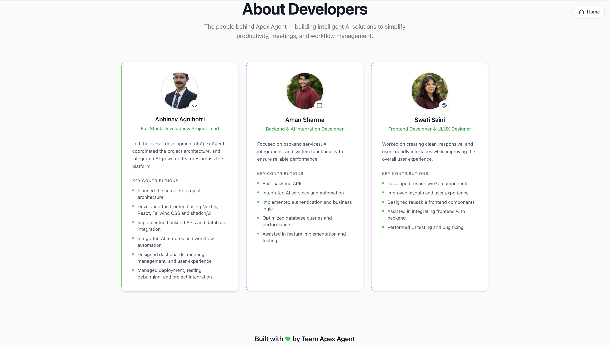
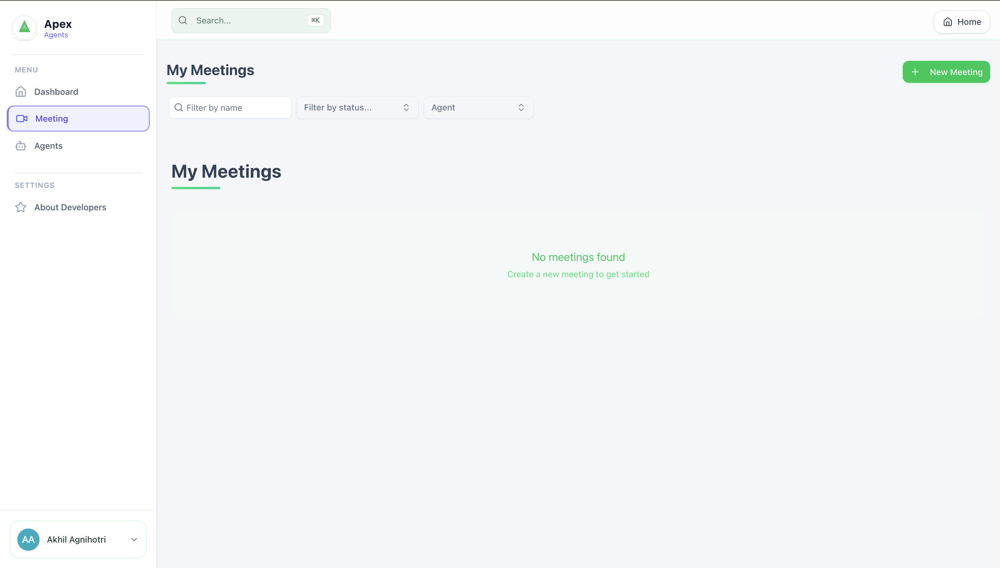
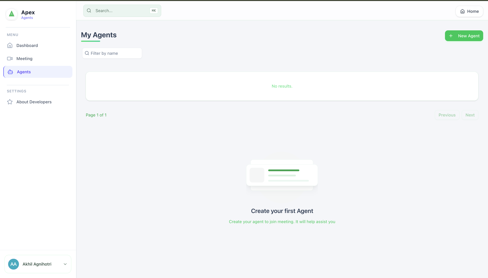

# Apex Agent

**Your intelligent agent for seamless automation and productivity.**

Apex Agent is a modern SaaS platform that combines AI-powered meeting management, agent automation, and real-time collaboration into a single, elegant dashboard. Built with Next.js 15, tRPC, Better Auth, and Stream Video.

---

## Tech Stack

| Layer | Technology |
|-------|-----------|
| **Framework** | Next.js 15 (App Router) |
| **Language** | TypeScript |
| **Styling** | Tailwind CSS 4 + shadcn/ui |
| **API Layer** | tRPC v11 |
| **Database** | PostgreSQL via Neon + Drizzle ORM |
| **Auth** | Better Auth |
| **Video** | Stream Video SDK |
| **Background Jobs** | Inngest |
| **AI** | OpenAI, Inngest Agent Kit |
| **Forms** | react-hook-form + zod |
| **Data Fetching** | TanStack React Query |
| **Payments** | Stripe |

---

## Screenshots

| Dashboard | Sign In |
|-----------|---------|
|  |  |

| Sign Up | About Developers |
|---------|-----------------|
|  |  |

| Meetings | Agents |
|----------|--------|
|  |  |

---

## Features

- **AI Agent Management** — Create, configure, and deploy AI agents for automated workflows
- **Meeting Management** — Schedule, join, and manage video meetings with real-time AI assistance
- **Smart Search** — AI-powered search across meetings and agents
- **Analytics Dashboard** — Track meeting stats, talk time, and agent performance
- **Notifications** — Real-time notifications for meetings, summaries, and updates
- **Authentication** — Email/password + Google & GitHub social login
- **Responsive Design** — Optimized for desktop, tablet, and mobile

---

## Getting Started

### Prerequisites

- Node.js 18+
- npm / pnpm / yarn
- A PostgreSQL database (Neon recommended)
- Stream Video API key
- Inngest account (for background jobs)
- OpenAI API key (for AI features)

### Environment Variables

Create a `.env` file in the root directory:

```env
# Database
DATABASE_URL=

# Auth
BETTER_AUTH_SECRET=
BETTER_AUTH_URL=

# Stream Video
NEXT_PUBLIC_STREAM_VIDEO_API_KEY=
STREAM_VIDEO_SECRET_KEY=

# Inngest
INNGEST_SIGNING_KEY=
INNGEST_EVENT_KEY=

# OpenAI
OPENAI_API_KEY=

# App
NEXT_PUBLIC_APP_URL=http://localhost:3000
```

### Installation

```bash
# Install dependencies
npm install

# Push database schema
npm run db:push

# Start development server
npm run dev
```

Open [http://localhost:3000](http://localhost:3000) to see the application.

### Available Scripts

| Command | Description |
|---------|-------------|
| `npm run dev` | Start development server |
| `npm run build` | Production build |
| `npm run start` | Start production server |
| `npm run lint` | Run ESLint |
| `npm run db:push` | Push Drizzle schema to database |
| `npm run db:studio` | Open Drizzle Studio |

---

## Project Structure

```
src/
├── app/                      # Next.js App Router pages & API routes
│   ├── (auth)/               # Auth pages (sign-in, sign-up)
│   ├── (dashboard)/          # Dashboard layout & pages
│   ├── api/                  # API route handlers
│   │   ├── auth/             # Better Auth endpoints
│   │   └── trpc/             # tRPC HTTP handler
│   └── about-developers/     # About Developers page
├── components/               # Shared UI components (shadcn/ui)
├── db/                       # Database schema & connection
├── hooks/                    # Shared React hooks
├── inngest/                  # Inngest background job functions
├── lib/                      # Utility libraries (auth, stream-video, etc.)
├── modules/                  # Feature modules (domain-driven)
│   ├── agents/               # AI Agent management
│   ├── auth/                 # Authentication UI
│   ├── call/                 # Video calling UI
│   ├── dashboard/            # Dashboard shell (sidebar, navbar)
│   ├── home/                 # Home/dashboard page
│   ├── meetings/             # Meeting management
│   └── notifications/        # Notifications
├── trpc/                     # tRPC setup & routers
│   ├── init.ts               # tRPC initialization & auth middleware
│   ├── client.tsx            # Client-side tRPC provider
│   ├── server.tsx            # Server-side tRPC proxy
│   └── routers/              # tRPC route definitions
└── types/                    # TypeScript type declarations
```

---

## Architecture

### API Layer (tRPC)

The application uses tRPC v11 for end-to-end type-safe API calls:
- **Server**: Routers in `src/modules/*/server/procedures.ts`
- **Client**: Auto-generated type-safe hooks via `@trpc/tanstack-react-query`
- **Context**: Session-based authentication via Better Auth middleware

### Authentication

Better Auth handles authentication with support for:
- Email/password authentication
- Google OAuth
- GitHub OAuth
- Session management with cookie-based auth

### Database

Drizzle ORM with PostgreSQL (Neon):
- Schema defined in `src/db/schema.ts`
- Auto-generated relations in `drizzle/`
- Migrations via `drizzle-kit`

### Real-time Video

Stream Video SDK powers:
- Video meetings with real-time AI
- Call management and recording
- Participant tracking

---

## Deployment

The application is optimized for deployment on Vercel:

```bash
npm run build
```

Ensure all environment variables are configured in your Vercel project settings.

---

## Team

- **Abhinav Agnihotri** — Full Stack Developer & Project Lead
- **Aman Sharma** — Backend & AI Integration Developer
- **Swati Saini** — Frontend Developer & UI/UX Designer

---

## License

This project is private and confidential.
